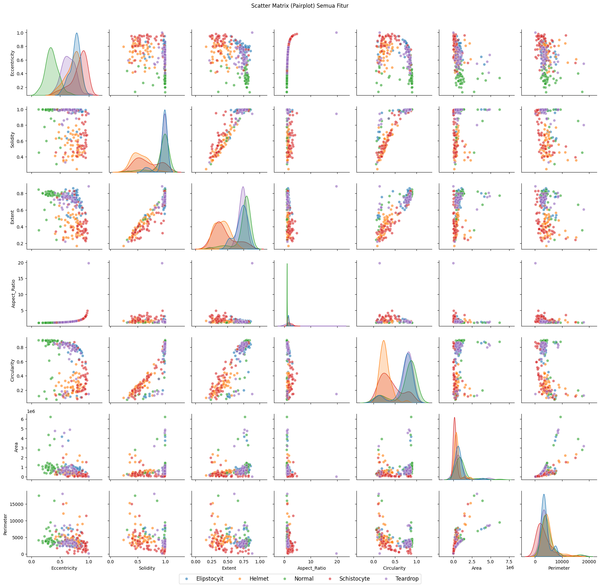
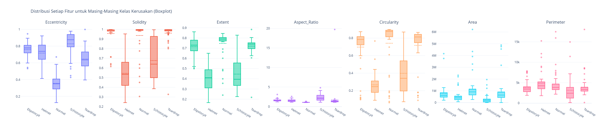
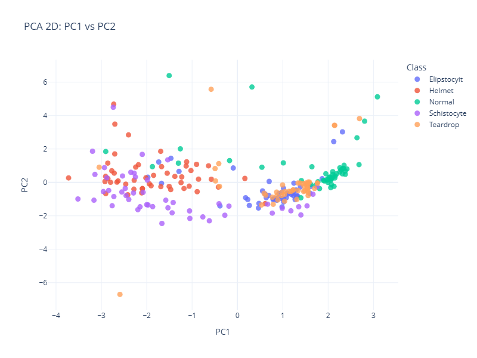
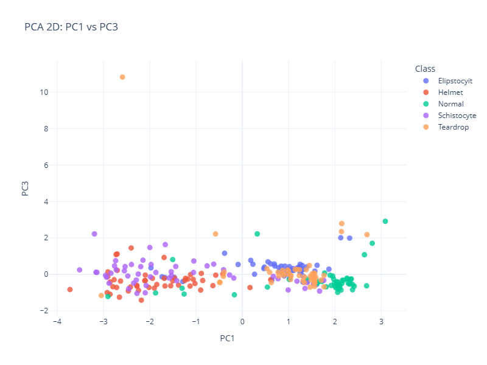
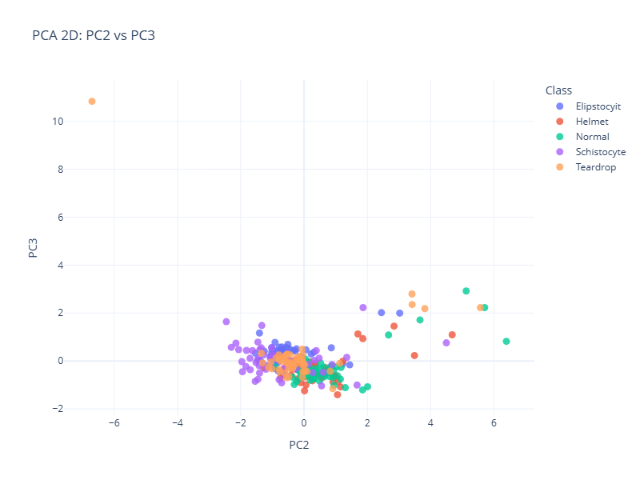

# RBC Morphology Plastic Exposure

This repository contains the master dataset and analysis results for the research on RBC (Red Blood Cell) Morphology and Plastic Exposure used in the 2025 Paper on Blood Cell Damage.

## Workflow

### Blood Cell Detection Flowchart - Part 1

### Blood Cell Detection Flowchart - Part 2

## Analysis Results

### Pair Plot Analysis

### Box Plot Distribution

### PCA Analysis
The Principal Component Analysis (PCA) results visualizing the data separaion:

| PCA 1 | PCA 2 | PCA 3 |
|-------|-------|-------|
|  |  |  |

## Dataset Structure
The dataset is organized into the following categories:
- **Normal**
- **Elipstocyit**
- **Helmet**
- **Schistocyte**
- **Teardrop**
